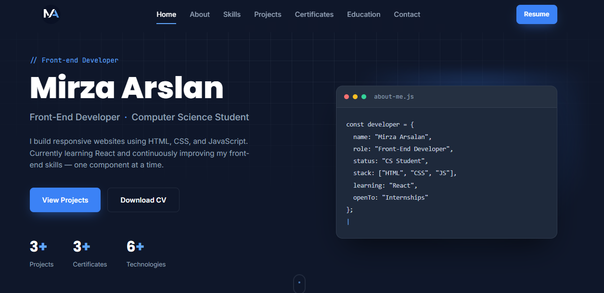

# 💼 Mirza Arslan - Portfolio Website

A modern and responsive personal portfolio website built using **HTML, CSS, and JavaScript**. This portfolio showcases my skills, projects, education, certifications, and contact information as an aspiring Front-End Developer.

---

## 🌐 Live Demo

🔗 [https://YOUR-VERCEL-LINK.vercel.app](https://mirza-portfolio-puce.vercel.app/)

---

## ✨ Features

- Responsive Design
- Modern User Interface
- About Me Section
- Skills Section
- Projects Showcase
- Education Timeline
- Certificates Section
- Contact Information
- Download Resume Button
- Smooth Scrolling
- Mobile Friendly

---

## 🛠 Technologies Used

- HTML5
- CSS3
- JavaScript (ES6)
---

## 📸 Screenshot

---

## 🚀 Getting Started

Clone this repository

   [Git Clone](https://github.com/MirzaArslan13/Portfolio-Website.git)

## 👨‍💻 Author

**Mirza Arslan**

📍 Lahore, Pakistan

💻 GitHub:
    [Github](https://github.com/MirzaArslan13)

🔗 LinkedIn:
    [Linkedin](https://www.linkedin.com/in/mirza-arslan-sattar-240a89349)

---

## 📄 License

This project is licensed under the MIT License.
